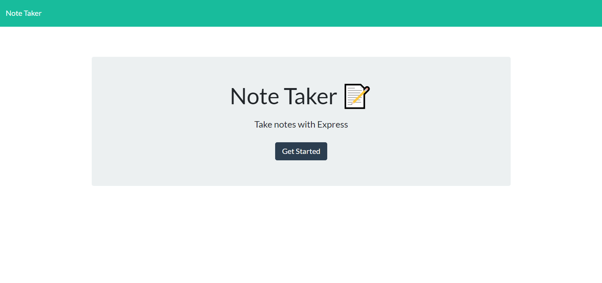
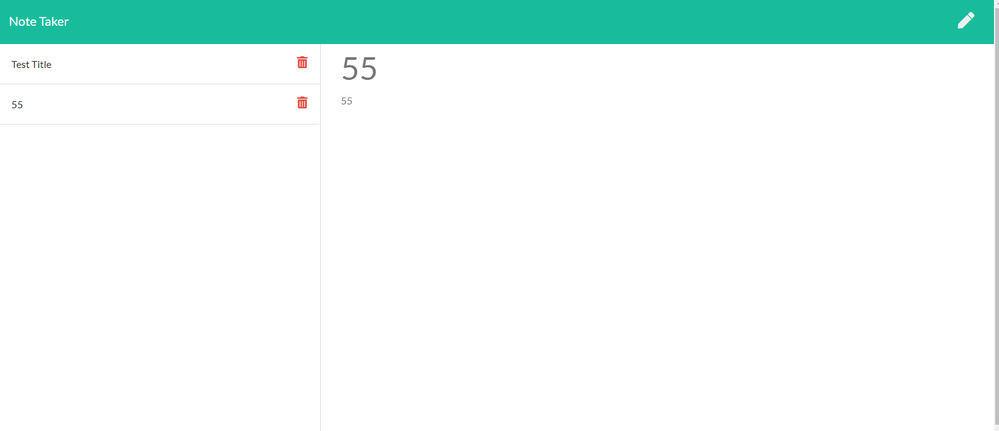

# Note Taker

## Description

This application is intended to organize a person's daily work life with simple to use features within the browser.

## Table of Contents

* [Features](#Features)
* [Links](#Links)
* [Screenshots](#Screenshots)
* [Language](#Language)

## Features

- [x] User can edit note titles and text.
- [x] User can save notes they made.
- [x] User can deletes notes they made.
- [x] Notes are retained through a json object.

## Links

* Project Repo: [Repository](https://github.com/Darrellfr3/Note-Taker)
* Deployed Page: [Website](https://jeishu.github.io/work-day-scheduler/)

## Screenshots

## Language

* JavaScript
* HTML
* CSS
* [Node](https://nodejs.org/en/)
* [jQuery](https://jquery.com/)
* [Bootstrap](https://getbootstrap.com/)
* [Express](https://expressjs.com/)
* [uuid](https://github.com/uuidjs/uuid#readme)
